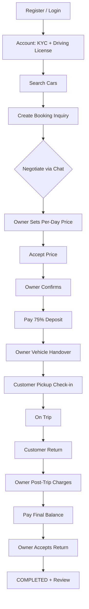

# CarManage (CM-P2P) — Customer Flow Functionality Document

**Product:** Peer-to-peer car rental platform  
**Role:** `CUSTOMER`  
**Last updated:** From codebase analysis (CarManage monorepo)

---

## 1. Purpose & scope

This document describes the end-to-end **customer journey**: registration, KYC, search, booking, negotiation, payments, trip handover, final settlement, and reviews. It includes **calculations**, **validations**, API endpoints, and UI routes.

There is **no admin role** in the application. Customers interact only with owners and the platform payment/settlement logic.

---

## 2. Prerequisites & access gates

| Gate | Requirement | Enforced by |
|------|-------------|-------------|
| Authentication | Valid JWT (`Authorization: Bearer`) | API middleware |
| Role | `CUSTOMER` for booking/payment routes | `RequireRole` |
| KYC | `is_kyc_verified = true` | `KYCVerified` middleware + UI |
| Driving license | Non-empty on profile | API on `POST /bookings`; UI before book modal |
| Deposit terms | `acknowledged_deposit_terms: true` on create | API |

**Self KYC (demo):** When `allow_self_kyc_verify: true` in backend YAML, customer can mark KYC verified from **Account** (`POST /api/me/complete-kyc`).

---

## 3. Customer journey (step-by-step)

### Phase A — Onboarding

| Step | UI route | API | Description |
|------|----------|-----|-------------|
| 1 | `/register` | `POST /api/auth/register` | Register with role `CUSTOMER` |
| 2 | `/login` | `POST /api/auth/login` | Sign in; receive JWT (default TTL 72h) |
| 3 | `/account` | `GET /api/me`, `PUT /api/me` | Update profile, driving license |
| 4 | `/account` | `POST /api/me/complete-kyc` | Mark KYC verified (if allowed) |
| 5 | `/account` | `POST /api/me/kyc-attachments` | Upload KYC document (requires Azure config) |

### Phase B — Search & book

| Step | UI route | API | Description |
|------|----------|-----|-------------|
| 1 | `/customer/search` | `GET /api/cars` | Search active listings (`location`, `model`, pagination) |
| 2 | Car detail (modal/page) | `GET /api/cars/:id` | View listing details |
| 3 | Book modal | `POST /api/bookings` | Create booking inquiry |
| 4 | Redirect | — | Navigate to `/bookings/[id]` |

**Create booking payload (key fields):**

- `car_id`, `rental_from`, `rental_to`
- `acknowledged_deposit_terms: true` (required)
- Optional: `pickup_location`, `drop_location`, `note`

### Phase C — Negotiation (`/bookings/[id]`)

| Action | API | When allowed |
|--------|-----|--------------|
| View booking | `GET /api/bookings/:id` | Participant only |
| List my bookings | `GET /api/bookings/mine` | Customer JWT |
| Edit trip dates / pickup / drop | `PATCH /api/bookings/:id/trip` | Status `PENDING` or `NEGOTIATING` |
| Chat | `GET/POST /api/bookings/:id/messages` | Participant; first message may move status to `NEGOTIATING` |
| Accept owner's quoted price | `POST /api/bookings/:id/accept-price` | Owner has set `final_booking_price` |
| Withdraw | `POST /api/bookings/:id/withdraw` | No final price set yet |
| Cancel | `POST /api/bookings/:id/cancel` | Inquiry or unpaid confirmed booking |

**Booking status flow (customer perspective):**

```
PENDING → NEGOTIATING → (accept price + owner confirms) → CONFIRMED
         ↘ CANCELLED (withdraw / cancel)
```

### Phase D — Payment (deposit 75%)

| Step | UI route | API | Description |
|------|----------|-----|-------------|
| 1 | `/customer/bookings/[id]/pay` | `GET /api/bookings/:id` or `payment-preview` | See breakdown |
| 2 | Pay | `POST /api/bookings/:id/payment-order` | Razorpay order (if configured) |
| 3 | Complete | `POST /api/bookings/:id/pay` | Record deposit or final payment |

**Payment status (customer):**

```
UNPAID → (pay 75% deposit) → DEPOSIT_PAID → (owner post-trip charges) → FINAL_DUE → (pay balance) → PAID
```

### Phase E — Trip handover

On `/bookings/[id]` after deposit is paid:

| Step | Who acts | API | Trip stage (UI) |
|------|----------|-----|-----------------|
| 1 | Owner hands over vehicle | — (wait) | `awaiting_owner_handover` |
| 2 | Customer pickup check-in | `PATCH /api/bookings/:id/handover` (phase `pickup`) | `awaiting_customer_pickup` → `on_trip` |
| 3 | Customer return | `PATCH /handover` (phase `return`) | `awaiting_customer_return` |
| 4 | Owner adds post-trip charges | — (wait) | `awaiting_post_trip_charges` |
| 5 | Customer pays final balance | `POST /pay` | `awaiting_final_payment` |
| 6 | Owner accepts return | — (wait) | `awaiting_owner_return_acceptance` → `return_complete` |

**Handover photos:** `POST /api/bookings/:id/handover/photos` (JPEG/PNG/WebP, max 10 per step).

### Phase F — Review

| Step | API | Rules |
|------|-----|-------|
| Post-trip review | `POST /api/bookings/:id/reviews` | After `rental_to` (UTC), payment `PAID`, rating 1–5, one review per party |

---

## 4. Calculations (customer-facing)

Configurable defaults (`backend/config/*.yaml`):

| Setting | Default |
|---------|---------|
| `customer_commission_percent` | 2% |
| `owner_commission_percent` | 1.5% (affects owner net, not customer total directly) |
| `gst_percent_on_commission` | 18% |
| Deposit | **75%** of customer trip total |

If commission percents are both 0 in YAML, code resets to 2% / 1.5%. If GST is 0, resets to 18%.

### 4.1 Formula reference

| # | Name | Formula | Rounding |
|---|------|---------|----------|
| 1 | **Trip days (inclusive)** | UTC calendar days from `rental_from` through `rental_to`, minimum 1 | Integer |
| 2 | **Agreed rental base** | `FinalBookingPrice × trip_days` | 2 decimal places |
| 3 | **Customer commission** | `agreed_base × customer_commission% ÷ 100` | 2 dp |
| 4 | **Customer GST** | `(agreed_base + customer_commission) × gst% ÷ 100` | 2 dp |
| 5 | **Customer total (trip)** | `agreed_base + customer_commission + customer_GST` | 2 dp |
| 6 | **Deposit due** | `customer_total × 75%` | 2 dp |
| 7 | **Trip balance (after deposit)** | `customer_total − deposit_paid` | 2 dp |
| 8 | **Final due** | `customer_total + post_trip_charges − deposit_paid` (minimum 0) | 2 dp |
| 9 | **Customer total paid (when PAID)** | `customer_total + post_trip_charges` | Stored on booking |
| 10 | **Razorpay amount** | `due_inr × 100` paise (minimum ₹1.00) | Integer paise |

**Source:** `booking_rental.go`, `booking_payment.go`, `booking_settlement.go`

### 4.2 Worked example

**Inputs:** Negotiated price ₹1,000/day, rental 2 inclusive days, customer commission 2%, GST 18%.

| Line | Calculation | Amount (₹) |
|------|-------------|--------------|
| Agreed base | 1000 × 2 | 2,000.00 |
| Customer commission | 2000 × 2% | 40.00 |
| Customer GST | (2000 + 40) × 18% | 367.20 |
| **Customer total** | | **2,407.20** |
| Deposit (75%) | 2407.20 × 75% | 1,805.40 |
| Trip balance | 2407.20 − 1805.40 | 601.80 |

**After trip:** If owner adds post-trip charges ₹500:

| Line | Amount (₹) |
|------|------------|
| Final due | 2407.20 + 500.00 − 1805.40 = **1,101.80** |

### 4.3 What is NOT auto-calculated for customers

- Car listing `price_per_hour`, `price_per_km` are **display hints only**; payment uses owner-set **per-day** `final_booking_price` only.
- Distance, fuel, tolls, damage are **not** auto-computed; they appear via owner's **post-trip charge lines** after return.

---

## 5. Validations (customer)

### 5.1 Registration & profile

| Field | Rule |
|-------|------|
| Email | Required, valid format, lowercased, unique |
| Password | Minimum 8 characters |
| Role | `CUSTOMER` or `OWNER` only |
| Full name, Aadhaar, phone, address | Required, non-empty |
| Driving license | Optional at register; **required** before booking |

### 5.2 Booking create

| Rule | Error context |
|------|----------------|
| Customer role + KYC verified | Middleware / service |
| Driving license on profile | Service |
| Car is active | Service |
| Cannot book own car | Service |
| `rental_to` after `rental_from` | Service |
| No date overlap with PENDING/NEGOTIATING/CONFIRMED bookings on same car | Repository |
| `acknowledged_deposit_terms: true` | `BOOKING_TERMS` |

### 5.3 Trip update (`PATCH /trip`)

| Rule | |
|------|--|
| Status `PENDING` or `NEGOTIATING` | |
| Pickup and drop locations non-empty | |
| Valid date range; no overlap (excluding current booking) | |

### 5.4 Price acceptance & cancel

| Rule | |
|------|--|
| Accept price only when owner has set `final_booking_price` | |
| Withdraw only when **no** final price set | |
| Cancel confirmed booking only if payment still `UNPAID` | |
| Cannot cancel after deposit paid | |

### 5.5 Payment

| Rule | |
|------|--|
| Booking status `CONFIRMED` with final price set | |
| Method: `UPI`, `CARD`, `NET_BANKING`, `QR_CODE` | |
| Deposit: only from `UNPAID` | |
| Final payment: only from `FINAL_DUE` (owner must submit post-trip charges first) | |
| Razorpay: signature verification on proof payload | |

### 5.6 Handover (customer actions)

| Rule | |
|------|--|
| Booking `CONFIRMED`, deposit paid | |
| Phase: `pickup` or `return` | |
| Odometer: 1 … 2,000,000 km | |
| Fuel level: 0–100 if provided | |
| Return odometer ≥ pickup odometer | |
| Strict sequence: owner pickup → customer pickup → on trip → customer return → … | |

### 5.7 Handover photos

| Rule | |
|------|--|
| JPEG, PNG, WebP only | |
| Max 10 photos per step | |
| Correct step/role/phase for upload | |

### 5.8 Reviews

| Rule | |
|------|--|
| Booking `CONFIRMED` or `COMPLETED`, payment `PAID` | |
| Current time after `rental_to` (UTC) | |
| Rating 1–5 | |
| One review per party per booking | |

### 5.9 Frontend-only (simulated checkout)

On pay page when Razorpay is not used: UI validates demo UPI/card/net-banking/QR fields — **not sent to API** for simulated pay.

---

## 6. API summary (customer-specific)

| Method | Path | Purpose |
|--------|------|---------|
| POST | `/api/auth/register` | Register |
| POST | `/api/auth/login` | Login |
| GET/PUT | `/api/me` | Profile |
| POST | `/api/me/complete-kyc` | Self KYC |
| POST | `/api/me/kyc-attachments` | KYC upload |
| GET | `/api/cars` | Search |
| GET | `/api/cars/:id` | Car detail |
| POST | `/api/bookings` | Create inquiry |
| GET | `/api/bookings/mine` | My bookings |
| GET | `/api/bookings/:id` | Booking detail |
| PATCH | `/api/bookings/:id/trip` | Update dates/locations |
| POST | `/api/bookings/:id/messages` | Chat |
| POST | `/api/bookings/:id/accept-price` | Accept quoted price |
| POST | `/api/bookings/:id/withdraw` | Withdraw inquiry |
| POST | `/api/bookings/:id/cancel` | Cancel |
| GET | `/api/bookings/:id/payment-preview` | Payment breakdown |
| POST | `/api/bookings/:id/payment-order` | Razorpay order |
| POST | `/api/bookings/:id/pay` | Pay deposit/final |
| PATCH | `/api/bookings/:id/handover` | Pickup/return |
| POST | `/api/bookings/:id/handover/photos` | Handover photos |
| POST | `/api/bookings/:id/reviews` | Review |

---

## 7. UI routes (customer)

| Route | Purpose |
|-------|---------|
| `/` | Marketing home |
| `/register`, `/login` | Auth |
| `/account` | Profile, KYC, license |
| `/customer/search` | Search & book |
| `/customer/bookings` | Booking list |
| `/customer/bookings/[id]/pay` | Deposit / final payment |
| `/bookings/[id]` | Shared hub (chat, handover, status) |

---

## 8. Integrations affecting customer

| Integration | Behavior |
|-------------|----------|
| **Razorpay** | Real payments when `key_id` + `key_secret` configured |
| **Simulated pay** | Demo checkout without Razorpay |
| **Azure Blob** | KYC and handover photo storage |
| **Twilio** | SMS to customer on owner confirm (if configured) |

---

## 9. Key source files

| Area | Path |
|------|------|
| Booking service | `backend/internal/service/booking.go` |
| Pricing | `backend/internal/service/booking_payment.go`, `booking_rental.go` |
| Settlement | `backend/internal/service/booking_settlement.go` |
| Handover stages | `backend/internal/service/booking_handover_stage.go` |
| Frontend pricing example | `frontend/lib/pricingCalculationExample.ts` |
| Customer pay UI | `frontend/app/customer/bookings/[id]/pay/page.tsx` |
| Shared booking UI | `frontend/app/bookings/[id]/page.tsx` |

---

## 10. Customer flow diagram


