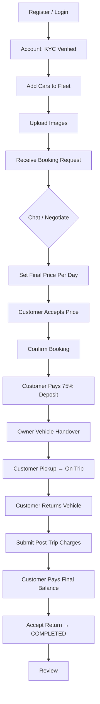
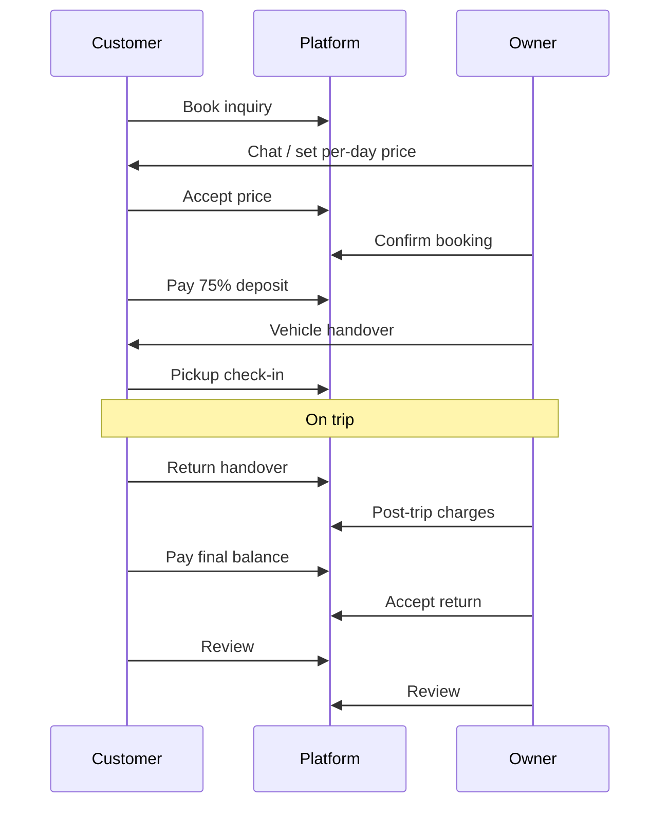

# CarManage (CM-P2P) — Owner Flow Functionality Document

**Product:** Peer-to-peer car rental platform  
**Role:** `OWNER`  
**Last updated:** From codebase analysis (CarManage monorepo)

---

## 1. Purpose & scope

This document describes the end-to-end **owner journey**: registration, KYC, fleet management, handling booking requests, pricing, confirmation, handover, post-trip settlement, payout view, and reviews. It includes **calculations**, **validations**, API endpoints, and UI routes.

There is **no admin role** in the application.

---

## 2. Prerequisites & access gates

| Gate | Requirement | Enforced by |
|------|-------------|-------------|
| Authentication | Valid JWT | API middleware |
| Role | `OWNER` for fleet/booking-management routes | `RequireRole` |
| KYC | `is_kyc_verified = true` | `KYCVerified` middleware |
| Driving license | **Not required** for owners | — |

**Self KYC (demo):** Same as customer — `allow_self_kyc_verify` in YAML enables `POST /api/me/complete-kyc`.

---

## 3. Owner journey (step-by-step)

### Phase A — Onboarding

| Step | UI route | API | Description |
|------|----------|-----|-------------|
| 1 | `/register` | `POST /api/auth/register` | Register with role `OWNER` |
| 2 | `/login` | `POST /api/auth/login` | Sign in; JWT issued |
| 3 | `/account` | `GET/PUT /api/me` | Profile; optional KYC attachments |

### Phase B — Fleet management

| Step | UI route | API | Description |
|------|----------|-----|-------------|
| 1 | `/owner/fleet` | `GET /api/cars/mine` | List owner's cars |
| 2 | `/owner/cars/new` | `POST /api/cars` | Create listing |
| 3 | `/owner/cars/[id]/edit` | `GET /api/cars/:id/edit`, `PATCH /api/cars/:id` | Edit listing |
| 4 | Fleet page | `POST /api/cars/:id/images` | Upload car images (Azure) |
| 5 | Edit page | `DELETE /api/cars/:id` | Remove listing |

**Listing prices** (`price_per_hour`, `price_per_day`, `price_per_km`) are **negotiation/display hints**. Booking settlement uses **negotiated per-day** `final_booking_price` on the booking record only.

**Restriction:** Cannot edit a car if it has a booking covering the **current UTC calendar day** (`CAR_BOOKED_TODAY`).

### Phase C — Booking requests

| Step | UI route | API | Description |
|------|----------|-----|-------------|
| 1 | `/owner/bookings` | `GET /api/bookings/mine` | Incoming requests |
| 2 | `/bookings/[id]` | `GET /api/bookings/:id` | Request detail (shared with customer) |

| Action | API | Notes |
|--------|-----|-------|
| Chat | `POST /api/bookings/:id/messages` | Negotiation |
| Set final price (per day) | `PATCH /api/bookings/:id/price` | Clears customer price acceptance if changed |
| Confirm booking | `POST /api/bookings/:id/confirm` | Requires price set + customer accepted; may send Twilio SMS |
| Cancel | `POST /api/bookings/:id/cancel` | Unpaid inquiry/confirmed only |

**Status flow (owner perspective):**

```
Customer creates → PENDING → NEGOTIATING (chat)
Owner sets price → Customer accepts → Owner confirms → CONFIRMED
```

### Phase D — After customer pays deposit

| Action | API | Trip stage |
|--------|-----|------------|
| Record vehicle handover to customer | `PATCH /api/bookings/:id/handover` (phase `pickup`) | `awaiting_owner_handover` |
| Upload handover photos | `POST /api/bookings/:id/handover/photos` | Step `owner_pickup` |

Then customer completes pickup check-in → **on trip**.

### Phase E — After customer returns vehicle

| Action | API | Trip stage |
|--------|-----|------------|
| Wait for customer return | — | `awaiting_customer_return` |
| Submit post-trip charges | `PUT /api/bookings/:id/post-trip-charges` | `awaiting_post_trip_charges` → sets `FINAL_DUE` |
| Wait for customer final payment | — | `awaiting_final_payment` |
| Accept return | `PATCH /handover` (phase `return`, reuses return odometer) | `awaiting_owner_return_acceptance` → `COMPLETED` |

### Phase F — Review & payout view

| Item | Description |
|------|-------------|
| Review | `POST /api/bookings/:id/reviews` (same rules as customer) |
| Payout display | `owner_net_inr` (rental) + `post_trip_charges` in `owner_projected_payout_inr` until fully paid; after `PAID`, settlement view shows `owner_net` |

---

## 4. Calculations (owner-facing)

Configurable defaults (`backend/config/*.yaml`):

| Setting | Default |
|---------|---------|
| `owner_commission_percent` | 1.5% |
| `customer_commission_percent` | 2% (on customer total, not deducted from owner base) |
| `gst_percent_on_commission` | 18% |
| Customer deposit | 75% of **customer** trip total (owner does not collect deposit directly in app logic) |

### 4.1 Formula reference (owner net & payout)

| # | Name | Formula | Rounding |
|---|------|---------|----------|
| 1 | **Trip days (inclusive)** | UTC calendar days, min 1 | Integer |
| 2 | **Agreed rental base** | `FinalBookingPrice × trip_days` | 2 dp |
| 3 | **Owner commission** | `agreed_base × owner_commission% ÷ 100` | 2 dp |
| 4 | **Owner GST** | `agreed_base × gst% ÷ 100` | 2 dp |
| 5 | **Owner net (rental)** | `agreed_base − owner_commission − owner_GST` | 2 dp |
| 6 | **Owner projected payout** | `owner_net + post_trip_charges_total` (before/through final due) | 2 dp |
| 7 | **Platform total** | `customer_comm + owner_comm + customer_GST + owner_GST` | 2 dp |

**Source:** `booking_payment.go`, `booking_settlement.go`, `booking_rental.go`

### 4.2 Worked example

**Inputs:** ₹1,000/day × 2 days, owner commission 1.5%, GST 18% on agreed base.

| Line | Calculation | Amount (₹) |
|------|-------------|--------------|
| Agreed base | 1000 × 2 | 2,000.00 |
| Owner commission | 2000 × 1.5% | 30.00 |
| Owner GST | 2000 × 18% | 360.00 |
| **Owner net** | 2000 − 30 − 360 | **1,610.00** |

**With post-trip charges ₹500** (tolls, cleaning, etc.):

| Line | Amount (₹) |
|------|------------|
| Owner projected payout | 1610.00 + 500.00 = **2,110.00** |

(Customer pays post-trip charges as part of final balance; owner receives net + those lines in payout projection.)

### 4.3 Post-trip charges (owner input)

| Constraint | Value |
|------------|-------|
| Max lines | 30 |
| Label max length | 240 characters |
| Per-line amount | ≥ 0, ≤ ₹500,000 |
| **Total** | ≤ ₹2,000,000 |
| Zero amounts | Skipped |

Charges can include tolls, fuel, damage, fines, cleaning — **manual line items**, not auto-calculated from odometer/fuel fields.

### 4.4 What owners do NOT configure in payment math

- Commission/GST percentages come from **platform YAML**, not per-owner.
- Per-hour and per-km listing prices do not drive settlement formulas.

---

## 5. Validations (owner)

### 5.1 Registration & profile

Same as customer except driving license is optional.

### 5.2 Car create / update

| Field | Rule |
|-------|------|
| `price_per_hour`, `price_per_day`, `price_per_km` | Valid decimal, ≥ 0 |
| Fuel type | `petrol`, `diesel`, `cng`, `ev` |
| Transmission | `auto`/`automatic`, `manual` |
| Model year | 1980 … current year + 2 |
| Color | Required |
| Seats | 1–20 |
| Mileage | ≥ 0 |
| Airbags | If enabled: count ≥ 1; detail rows sum = total count |
| Identity fields + location | Required on create |
| Update while booked today (UTC) | **Blocked** |

### 5.3 Price & confirm

| Rule | |
|------|--|
| Final price valid decimal, ≥ 0 | |
| Cannot update price if booking `CONFIRMED` or `CANCELLED` | |
| Changing price clears customer acceptance | |
| Confirm requires price set **and** customer accepted | |
| Twilio SMS optional on confirm | |

### 5.4 Cancel

| Rule | |
|------|--|
| Cancel unpaid inquiry or confirmed booking with `UNPAID` payment only | |
| Cannot cancel after customer paid deposit | |

### 5.5 Post-trip charges

| Rule | |
|------|--|
| Booking `CONFIRMED` | |
| Customer deposit paid (`DEPOSIT_PAID` or later) | |
| Customer return handover recorded | |
| Not after payment fully `PAID` | |
| Max 30 lines; total ≤ ₹2,000,000 | |

### 5.6 Handover (owner actions)

| Rule | |
|------|--|
| `CONFIRMED`, deposit paid | |
| Phase `pickup` or `return` | |
| Odometer 1 … 2,000,000 km | |
| Fuel 0–100 if provided | |
| Accept return only after customer return logged **and** payment `PAID` | |
| Return odometer ≥ pickup odometer (customer/owner readings) | |

### 5.7 Handover photos

| Rule | |
|------|--|
| JPEG, PNG, WebP | |
| Max 10 per step | |
| Owner steps: `owner_pickup`; accept return uses return phase rules | |

### 5.8 Reviews

Same as customer: after rental end (UTC), `PAID`, rating 1–5, one per party.

---

## 6. API summary (owner-specific)

| Method | Path | Purpose |
|--------|------|---------|
| POST | `/api/auth/register` | Register as OWNER |
| POST | `/api/auth/login` | Login |
| GET/PUT | `/api/me` | Profile |
| POST | `/api/me/complete-kyc` | Self KYC |
| POST | `/api/cars` | Create car |
| GET | `/api/cars/mine` | Fleet list |
| GET | `/api/cars/:id/edit` | Edit form data |
| PATCH | `/api/cars/:id` | Update car |
| DELETE | `/api/cars/:id` | Delete car |
| POST | `/api/cars/:id/images` | Upload image |
| GET | `/api/bookings/mine` | Owner bookings |
| GET | `/api/bookings/:id` | Detail |
| POST | `/api/bookings/:id/messages` | Chat |
| PATCH | `/api/bookings/:id/price` | Set per-day final price |
| POST | `/api/bookings/:id/confirm` | Confirm booking |
| POST | `/api/bookings/:id/cancel` | Cancel |
| PUT | `/api/bookings/:id/post-trip-charges` | Post-trip settlement lines |
| PATCH | `/api/bookings/:id/handover` | Handover / accept return |
| POST | `/api/bookings/:id/handover/photos` | Photos |
| POST | `/api/bookings/:id/reviews` | Review |

---

## 7. UI routes (owner)

| Route | Purpose |
|-------|---------|
| `/owner/fleet` | Fleet list + image upload |
| `/owner/cars/new` | Add car |
| `/owner/cars/[id]/edit` | Edit car |
| `/owner/bookings` | Booking requests |
| `/bookings/[id]` | Shared booking hub |
| `/account` | Profile & KYC |

Navigation is role-aware (`frontend/components/Nav.tsx`).

---

## 8. Booking & payment states (owner reference)

### Booking status

| Status | Owner actions |
|--------|----------------|
| `PENDING` | Chat, set price, cancel |
| `NEGOTIATING` | Chat, set/change price, cancel |
| `CONFIRMED` | Handover, post-trip charges, accept return |
| `COMPLETED` | Review |
| `CANCELLED` | None |

### Payment status (on confirmed bookings)

| Status | Owner actions |
|--------|----------------|
| `UNPAID` | Wait for customer deposit |
| `DEPOSIT_PAID` | Pickup handover; wait for return |
| `FINAL_DUE` | Post-trip charges submitted; wait for final pay |
| `PAID` | Accept return → complete trip |

### Trip handover stages

| Code | Label (typical) |
|------|-----------------|
| `awaiting_owner_handover` | Awaiting vehicle handover |
| `awaiting_customer_pickup` | Awaiting customer pickup |
| `on_trip` | On trip |
| `awaiting_customer_return` | Awaiting customer return |
| `awaiting_post_trip_charges` | Add post-trip charges |
| `awaiting_final_payment` | Awaiting final payment |
| `awaiting_owner_return_acceptance` | Accept return |
| `return_complete` | Trip complete |

---

## 9. Integrations affecting owner

| Integration | Behavior |
|-------------|----------|
| **Azure Blob** | Car images, handover photos |
| **Twilio** | SMS to customer on confirm (optional) |
| **Razorpay** | Customer payments; owner sees settlement amounts in API/UI |

---

## 10. Key source files

| Area | Path |
|------|------|
| Routes | `backend/internal/handler/routes.go` |
| Booking service | `backend/internal/service/booking.go` |
| Post-trip settlement | `backend/internal/service/booking_settlement.go` |
| Handover | `backend/internal/service/booking_handover_stage.go` |
| Car service | `backend/internal/service/car.go` |
| Owner fleet UI | `frontend/app/owner/fleet/page.tsx` |
| Owner bookings UI | `frontend/app/owner/bookings/page.tsx` |

---

## 11. Owner flow diagram



---

## 12. End-to-end interaction (customer ↔ owner)


